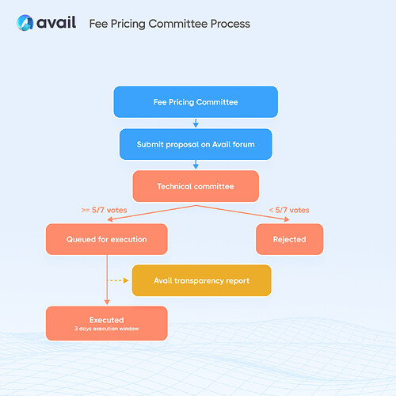

# Avail Fee Pricing Committee: Charter, Composition and Values

> **Migration notice:** This material was migrated from the Avail Forum to GitHub ahead of the forum's permanent closure on August 22, 2026. The original forum URL is retained as a historical source identifier, but the migrated content and source snapshots are preserved in this repository.

| Field | Value |
| --- | --- |
| Historical forum URL | https://forum.availproject.org/t/avail-fee-pricing-committee-charter-composition-and-values/1510 |
| Forum topic ID | 1510 |
| Original category | Governance V1 |
| Original author | Dan (@dan) |
| Created | 2024-08-20T04:01:19.147Z |
| Last posted | 2024-08-20T04:01:19.238Z |
| Forum posts included | 1 |
| Highest forum post number | 1 |
| Raw JSON snapshot | [topic-1510.json](../archive/raw-json/topic-1510.json) |
| Raw HTML snapshot | [topic-1510.html](../archive/raw-html/topic-1510.html) |

## Original Post

### Post 1

| Field | Value |
| --- | --- |
| Author | Dan (@dan) |
| Posted | 2024-08-20T04:01:19.238Z |
| Updated | 2024-08-20T04:01:19.238Z |
| Forum post number | 1 |
| Forum post ID | 2562 |
| Likes | 1 |

<h1>Avail’s Fee Pricing Committee</h1>

The Avail network has the ability to adjust DA fees based on demand and performance metrics to maintain an optimal balance for all users and network participants.

Avail’s Fee Pricing Committee (“FPC”) is responsible for <strong>establishing and recommending data submission fees</strong> within the network. These fees consist of a base fee calculated based on the resources used for data submission and a multiplier determined by the FPC.

The committee submits proposals to the technical committee outlining the proposed fee multipliers and their implications for the network. The technical committee evaluates the proposal, and if a majority consensus of 5/7 is reached, the TC will submit a transparency report to the community on executing the fee change.

To learn about Avail’s phased governance approach and the <a href="https://docs.availproject.org/docs/governance-on-avail/overview">current phase 1 governance</a> in place, please refer to the Avail docs. To discuss and provide feedback on Avail’s governance please use the<a href="https://forum.availproject.org/"> Avail community forum. </a>

<a class="lightbox" href="../archive/assets/1510/882e0baf9df7-96a37cb7696852d8135962ed7c17bf5f77b59f95.jpeg" data-download-href="../archive/assets/1510/d01d96717a76-lubtc0hnhf7si0hiz0e5gtmupcp.jpeg" title="Fee Pricing Committee Process|100%">
<svg class="fa d-icon d-icon-far-image svg-icon" aria-hidden="true"><use href="#far-image"></use></svg>Fee Pricing Committee Process|100%1600×1600 229 KB<svg class="fa d-icon d-icon-discourse-expand svg-icon" aria-hidden="true"><use href="#discourse-expand"></use></svg>
</a>

<h1>Objectives of the Fee Pricing Committee</h1>
<ul>
<li>

<strong>Ensure Equitable Fees:</strong> Establish a fee structure that is equitable for all participants, promoting broad participation in the network.

</li>
<li>

<strong>Maintain Network Stability:</strong> Set fees that support the network’s financial sustainability, ensuring that validators and other participants are adequately incentivized without relying solely on fees as their primary income source.

</li>
<li>

<strong>Maintain Affordability and Usability:</strong> Ensure fees remain affordable for all users, avoiding excessive costs that could deter participation or disproportionately impact bootstrapped participants.

</li>
<li>

<strong>Foster Experimentation and Growth:</strong> Set fees that encourage experimentation and innovation within the ecosystem, supporting new projects and services contributing to the network’s overall growth.

</li>
<li>

<strong>Maintain Transparency and Accountability:</strong> Operate transparently, providing clear rationale and supporting data with fee proposals to ensure accountability in decision-making.

</li>
</ul>
<h1>FPC Framework for Fee Determination</h1>

Avail’s Fee Pricing Committee (FPC) employs a comprehensive framework for determining data submission fees, designed to ensure fees are fair, stable, and conducive to the network’s overall health. The determination process involves the following key components:

<strong>Token Price Stability</strong>

The FPC evaluates token prices using specific time-weighted average periods, such as a 10-day TWAP (Time-Weighted Average Price). The goal is to derive a stable fee in real terms, ensuring that fluctuations in token prices do not adversely impact users’ affordability and fee predictability.

<strong>Fee Hygiene Checklist</strong>

The FPC uses the checklist below to ensure the proposed fee multiplier is within a reasonable range and does not have any negative impact on the following:

<strong>1. Network Congestion:</strong>

<ul>
<li>Transaction Volume: Monitoring the number of transactions within the network to assess activity levels.</li>
<li>Block Utilization: Evaluating the extent to which blocks are utilized to their optimal capacity.</li>
<li>Pending Transactions: Tracking the number of transactions waiting to be processed to identify bottlenecks.</li>
<li>Data Submission Rates: Analyzing the rate at which data is submitted to the network.</li>
<li>Root Cause Analysis: This involves determining whether congestion is due to spam, increased Total Value Locked (TVL), or token volatility and addressing the specific cause.</li>
</ul>

<strong>2. Comparative Analysis:</strong>

<ul>
<li>Affordability and Accessibility: Ensuring fees remain reasonable and do not exclude participants from the network.</li>
<li>Benchmarking: Comparing the proposed fees with those of similar networks to maintain competitiveness and fairness.</li>
</ul>

<strong>3. Participant Economics:</strong>

<ul>
<li>Validator Sustainability: Ensuring fees adequately contribute to validator incentives, ensuring the network remains secure and reliable.-</li>
</ul>

<strong>4. Demand Elasticity:</strong>

<ul>
<li>User Response Patterns: Studying how users react to fee changes to understand the elasticity of demand for data submission services.</li>
<li>Service Demand: Evaluating whether fee changes significantly impact the demand for data submission services.</li>
</ul>

The FPC’s framework for fee determination aims to balance the need for network sustainability to maintain an accessible and efficient ecosystem. By systematically analyzing key economic indicators and user behaviours, the FPC ensures the fee structure supports the long-term health and stability of the Avail network.

<h1>Governance</h1>

The FPC submits proposals to the Technical Committee through the Avail Improvement Proposal (AIP) process established through <a href="https://docs.availproject.org/docs/governance-on-avail">Avail’s Governance</a>. For the Fee Pricing Committee, the AIP follows a slightly different format specifically tailored to address fee multiplier analysis:

<strong>Metadata:</strong> RFC 822 style headers containing metadata about the AIP, a short descriptive title (limited to a maximum of 44 words), a description (limited to a maximum of 140 words), and the author details.

<strong>Proposed Fee Summary:</strong> A multi-sentence (short paragraph) summary that provides a terse and human-readable version of the proposed fee multiplier and the existing base fee. By reading the summary alone, someone should be able to grasp the essence of what the proposal entails.

<strong>Background and Rationale:</strong> Provide a brief background on the current fee structure and the need for the proposed changes. The rationale elaborates on the proposed fee by explaining the reasoning behind the design and the choices made during the design process.

<strong>Analysis and Impact:</strong> Describe how the proposed multiplier aims to stabilize fees in real terms. Analyze holistically the network congestion, token price stability, participant economics and/or demand elasticity.

<strong>Security Considerations or Risks:</strong> All AIPs must include a section discussing relevant security implications and considerations. This section should provide information critical for security discussions, expose risks, and be used throughout the proposal’s life-cycle. AIP submissions lacking a “Security Considerations” section will be rejected.

<strong>Copyright Waiver:</strong> All AIPs must be in the public domain. The copyright waiver MUST link to the license file and use the following wording: Copyright and related rights waived via CC0.

<h1>Avail Transparency Reports (ATR)</h1>

<a href="https://docs.availproject.org/docs/governance-on-avail/avail-transparency-report">Avail Transparency Reports (ATR)</a> are simple summaries of upcoming or executed changes submitted by the Technical Committee. It consists of details of the proposed changes, code (if necessary), potential merits to the network and necessary resources. These ATRs are posted on the<a href="https://forum.availproject.org/"> Avail Community Forum</a>.

<h1>Fee Pricing Committee</h1>

The composition for Fee Pricing Committee takes into consideration several parameters such as member responsiveness, technical competence, reputation, OpSec practices, geographic diversity and relevant voice from different work streams at Avail.

The Fee Pricing Committee will have representation from different chains building on Avail DA and will introduce voting parameters in upcoming Governance phases.

<table>
<thead>
<tr>
<th>Committee Member</th>
<th>Workstream at Avail</th>
</tr>
</thead>
<tbody>
<tr>
<td>Dan Mills</td>
<td>Product Management</td>
</tr>
<tr>
<td>Kyle Rojas</td>
<td>Business Development</td>
</tr>
<tr>
<td>Jackson Lewis</td>
<td>Validator Engagement</td>
</tr>
<tr>
<td>Ghali El Ouarzazi</td>
<td>Engineering - Node</td>
</tr>
<tr>
<td>QEDK</td>
<td>Engineering - Research</td>
</tr>
</tbody>
</table>

<h1>Fee Pricing Committee Values</h1>
<ul>
<li>

<strong>Integrity:</strong> Commit to ethical decision-making and uphold the highest standards of honesty and fairness in all fee-related matters.

</li>
<li>

<strong>Transparency:</strong> Ensure all processes and decisions are transparent, providing clear and accessible information to all stakeholders.

</li>
<li>

<strong>Responsiveness:</strong> Be responsive to the needs and feedback of the network participants, adapting fee structures as necessary to address emerging issues and opportunities.

</li>
<li>

<strong>Inclusivity:</strong> Promote inclusivity by considering the needs of all network participants, ensuring that fees do not create barriers to entry.

</li>
<li>

<strong>Sustainability and Collaboration:</strong> Prioritize the long-term sustainability of the network and work collaboratively with other committees and stakeholders, valuing diverse perspectives and expertise in the fee-setting process.

</li>
</ul>
<h1>Avail Community Forum</h1>

The <a href="https://forum.availproject.org/">Avail Community Forum</a> serves as the central hub within the Avail ecosystem, promoting collaboration among community members, developers, Validators, Committee members, and projects utilizing Avail. It offers a platform for exchanging ideas and discussions related to the Avail ecosystem and its wide range of applications and a space for cooperation on enhancements.

Members of the Fee Pricing Committee are strongly encouraged to actively participate in discussions to share their reports and proposals with the broader community.

<h1>Copyright</h1>

This work’s copyrights and related rights are waived under CC0 1.0 Universal.

## Forum Discussion

_No replies were present in the migrated forum topic._
