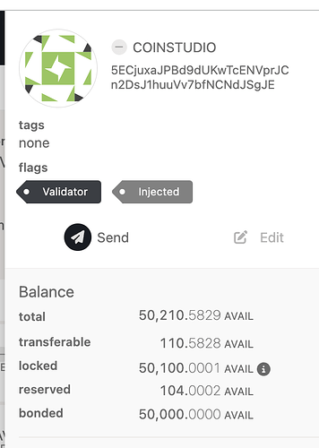

# Transparency Report 6: Migrated to FungibleAdapter

> **Migration notice:** This material was migrated from the Avail Forum to GitHub ahead of the forum's permanent closure on August 22, 2026. The original forum URL is retained as a historical source identifier, but the migrated content and source snapshots are preserved in this repository.

| Field | Value |
| --- | --- |
| Historical forum URL | https://forum.availproject.org/t/transparency-report-6-migrated-to-fungibleadapter/1567 |
| Forum topic ID | 1567 |
| Original category | Avail Transparency Report |
| Original author | Toufeeq  Pasha (@Toufeeq_Pasha) |
| Created | 2024-10-18T05:42:53.861Z |
| Last posted | 2024-10-22T09:15:52.324Z |
| Forum posts included | 4 |
| Highest forum post number | 4 |
| Raw JSON snapshot | [topic-1567.json](../archive/raw-json/topic-1567.json) |
| Raw HTML snapshot | [topic-1567.html](../archive/raw-html/topic-1567.html) |

## Original Post

### Post 1

| Field | Value |
| --- | --- |
| Author | Toufeeq  Pasha (@Toufeeq_Pasha) |
| Posted | 2024-10-18T05:42:53.931Z |
| Updated | 2024-10-18T05:43:14.808Z |
| Forum post number | 1 |
| Forum post ID | 2661 |
| Likes | 3 |

<strong>Report Author</strong>: Toufeeq from the Avail Technical Committee [5CoVaWrZnaV3BSeUJCA8Ca3SPMJDtjT1zPvZkzovkxJU7dkr] 
<strong>Change Executed</strong>: Changes will be applied at block #470,242 
<strong>Technical Committee Consensus</strong>: 5/7 signers <a href="https://avail.subscan.io/tech/15?tab=votes">https://avail.subscan.io/tech/15?tab=votes</a>

<strong>Introduction:</strong> 
This report aims to provide transparency to the Avail community regarding upcoming and executed network changes. The Avail Technical Committee (TC) has approved a runtime upgrade on Avail Mainnet, addressing an inconsistency identified in the upstream Polkadot SDK related to transferable balance calculations. This issue has been resolved by migrating to the FungibleAdapter in the transaction payment pallet. After a detailed review of the effectiveness, impact, and security of the upgrade, the TC reached a majority consensus (5/7) to proceed with the changes.

<strong>Proposed / Executed Changes:</strong>

The inconsistency was identified in the Polkadot SDK’s logic for computing transferable balances. This led to misleading calculations for users, potentially resulting in failed transactions due to insufficient balance to cover fees.

Previously, the formula for transferable balances was:

•	<strong>Old Formula:</strong> transferable = free - max(frozen, reserved)

The new formula is:

•	<strong>New Formula:</strong> transferable = free - (frozen - reserved)

The old formula, used by the CurrencyAdapter, did not accurately account for certain scenarios where frozen and reserved balances overlapped, leading to discrepancies. The migration to the FungibleAdapter, which uses the reducible_balances function (as outlined <a href="https://github.com/paritytech/polkadot-sdk/blob/e8da320734ae44803f89dd2b35b3cfea0e1ecca1/substrate/frame/balances/src/impl_fungible.rs#L44">here</a>), corrects this issue.

Additionally, this upgrade includes improvements to optimize election phragmen bounds.

<strong>Code Modifications:</strong> 
For those interested, you can review the necessary code modifications in the following PRs:

<ul>
<li><a href="https://github.com/availproject/avail/pull/650">PR1</a></li>
<li><a href="https://github.com/availproject/avail/pull/653">PR2</a></li>
</ul>

<strong>Potential Merits to the Network:</strong>

This change brings clarity and precision to balance calculations, ensuring users are accurately informed of their available spendable balance, thus preventing transaction failures. This correction improves the user experience by reducing confusion and avoiding unnecessary errors when covering transaction fees. Furthermore, the optimizations in the election process provide a more efficient and stable staking and governance experience

If you require any additional resources or information, please feel free to drop comments.

Thank you.

## Forum Discussion

The following replies were migrated from the original forum topic in chronological order.

### Post 2

| Field | Value |
| --- | --- |
| Author | @CoinStudio |
| Posted | 2024-10-21T07:59:59.302Z |
| Updated | 2024-10-21T07:59:59.302Z |
| Forum post number | 2 |
| Forum post ID | 2662 |
| Likes | 1 |

Great to see the reported issue solved 

### Post 3

| Field | Value |
| --- | --- |
| Author | @CoinStudio |
| Posted | 2024-10-21T20:54:55.920Z |
| Updated | 2024-10-21T20:54:55.920Z |
| Forum post number | 3 |
| Forum post ID | 2664 |
| Likes | 1 |

I originally reported this balance issue, which was primarily seen in the .js implementation, sometime in late August. The team did a fantastic job by quickly issuing a fix at the time. However, with the latest runtime upgrade and the changes described in this AIP, it appears that the bug has resurfaced. It seems the problem is mostly related to locked identity deposits, which are now being counted as transferable again despite being locked. Balance discrepancy is visible in the picture 

<a class="lightbox" href="../archive/assets/1567/4957a72cf310-3ccb7807889335278e5bc0e1acc2dd327070abfb.png" data-download-href="../archive/assets/1567/21146d9af41d-8fozqpsmrp2owybtcr8l4lnmgkt.png" title="Screenshot 2024-10-21 at 22.54.05" rel="noopener nofollow ugc">
<svg class="fa d-icon d-icon-far-image svg-icon" aria-hidden="true"><use href="#far-image"></use></svg>Screenshot 2024-10-21 at 22.54.05594×832 40.3 KB<svg class="fa d-icon d-icon-discourse-expand svg-icon" aria-hidden="true"><use href="#discourse-expand"></use></svg>
</a>

### Post 4

| Field | Value |
| --- | --- |
| Author | @CoinStudio |
| Posted | 2024-10-22T09:15:52.324Z |
| Updated | 2024-10-22T09:15:52.324Z |
| Forum post number | 4 |
| Forum post ID | 2668 |
| Likes | 0 |

After additional checks, it seems the new transferable balance formula works as intended. In the previous Polkadot SDK, locked and reserved balances never overlapped, which caused users to lock extra tokens for certain actions.

Now, in Avail, locked and reserved tokens can overlap, which is a good change. 

